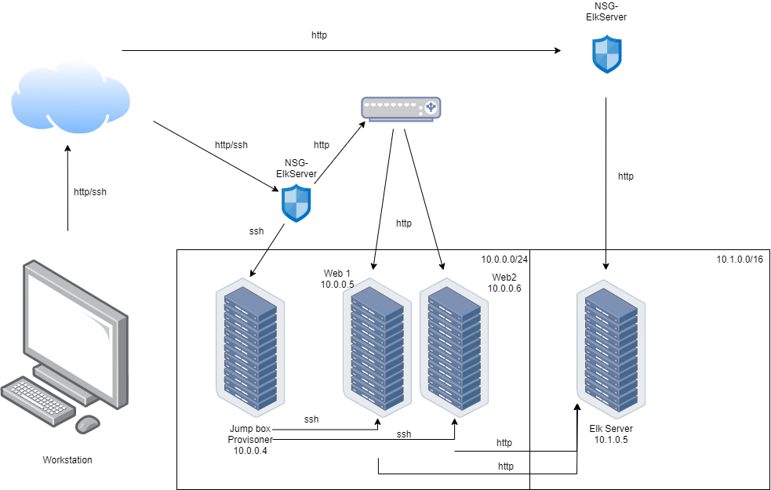

## Automated ELK Stack Deployment

The files in this repository were used to configure the network depicted below.

These files have been tested and used to generate a live ELK deployment on Azure. They can be used to either recreate the entire deployment pictured above. Alternatively, select portions of the _____ file may be used to install only certain pieces of it, such as Filebeat.

 /etc/ansible/install-elk-playbook.yml

This document contains the following details:
- Description of the Topologu
- Access Policies
- ELK Configuration
  - Beats in Use
  - Machines Being Monitored
- How to Use the Ansible Build

### Description of the Topology

The main purpose of this network is to expose a load-balanced and monitored instance of DVWA, the D*mn Vulnerable Web Application.

Load balancing ensures that the application will be highly efficient, in addition to restricting traffic to the network.

Integrating an ELK server allows users to easily monitor the vulnerable VMs for changes to the logs and system traffic.
What does Filebeat watch for?
 -Filebeat watches for any information in the file system which has been changed and when it has.
 -Filebeat watches for log files/locations and collects log events
What does Metricbeat record?
 -Metricbeat takes the metrics and statistics that collects and ships them to the output you specify.
 -Metricbeat records metric and statistical data from the operating system and from services running on the server.

The configuration details of each machine may be found below.
_Note: Use the [Markdown Table Generator](http://www.tablesgenerator.com/markdown_tables) to add/remove values from the table_.

| Name     | Function | IP Address | Operating System |
|----------|----------|------------|------------------|
| Jump Box | Gateway  | 10.0.0.4   | Linux            |
| Web1     |   Server       |    10.0.0.5        |     Linux             |
| Web2     |  Server        |    10.0.0.6       |          Linux        |
| ElkVM     |    Elk Server      |        10.1.0.5    |         Linux         |

### Access Policies

The machines on the internal network are not exposed to the public Internet. 

Only the jump box machine can accept connections from the Internet. Access to this machine is only allowed from the following IP addresses:
- Add whitelisted IP addresses:- - Public IP address which changes everytime when the VM is on/off eg of Public IP 137.135.115.14

Machines within the network can only be accessed by SSH.
 -Which machine did you allow to access your ELK VM? What was its IP address? JumpBox VM, its private Ip address(Vnet IP)-10.1.0.8
A summary of the access policies in place can be found in the table below.

| Name     | Publicly Accessible | Allowed IP Addresses |
|----------|---------------------|----------------------|
| Jump Box |     No              | 10.0.0.5 10.0.0.6   |
|   Web1       |    No                 |            10.1.0.5          |
|   Web2       |          No           |         10.1.0.5             |
|   ElkVM       |        No             |       10.0.0.4              |
### Elk Configuration

Ansible was used to automate configuration of the ELK machine. No configuration was performed manually, which is advantageous because...

What is the main advantage of automating configuration with Ansible?
 -This allows you to deploy to multiple servers using a single playbook

The playbook implements the following tasks:
Install docker.io
Install Python-pip
Install docker container
Launch docker container: elk

The following screenshot displays the result of running `docker ps` after successfully configuring the ELK instance.

### Target Machines & Beats
This ELK server is configured to monitor the following machines:
- Web-1(10.0.0.5) Web-2(10.0.0.6)

We have installed the following Beats on these machines:
-Filebeat and Metricbeat

These Beats allow us to collect the following information from each machine:
- _TODO: In 1-2 sentences, explain what kind of data each beat collects, and provide 1 example of what you expect to see. E.g., `Winlogbeat` collects Windows logs, which we use to track user logon events, etc._

### Using the Playbook
In order to use the playbook, you will need to have an Ansible control node already configured. Assuming you have such a control node provisioned: 

SSH into the control node and follow the steps below:

-copy the playbook file to /etc/ansible.
-Update the the configuration file to include the webservers and ElkVM (private Ip address.
-Run the playbook, and navigate to ElkVM to check that the installation worked as expected. 

_TODO: Answer the following questions to fill in the blanks:_
-Which file is the playbook? Where do you copy it? /etc/ansible/file/filebeat-configuration.yml
-Which file do you update to make Ansible run the playbook on a specific machine? How do I specify which machine to install the ELK server on versus which to install Filebeat on?_ edit the /etc/ansible/hosts file to add webserver/elkserver ip addresses
-Which URL do you navigate to in order to check that the ELK server is running? http://[your.ELK-VM.External.IP]:5601/app/kibana
